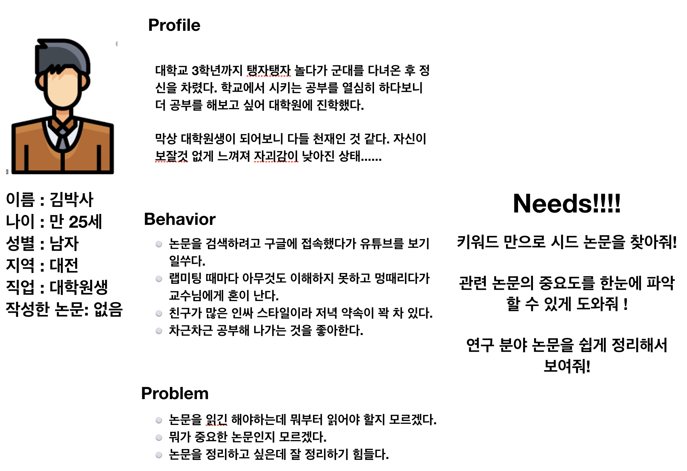
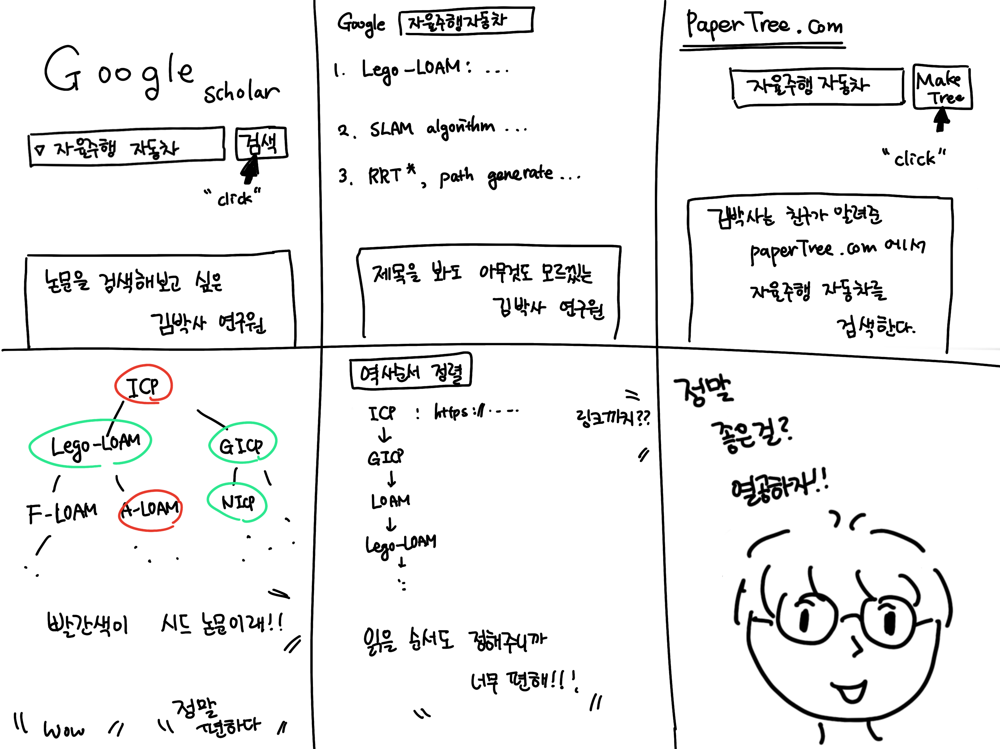

# 시드 논문을 찾아줘

   
   
   
### 서비스 개요
1. 검색하고자 하는 연구 분야의 키워드를 검색한다.
2. 키워드와 관련된 가장 빠른 논문을 구글에서 검색한다.
3. 검색된 논문의 reference들을 재귀적으로 검색한다.
4. 인용수 혹은 Impact factor가 큰 논문을 seed로 하여 시간 순으로 tree 구조를 완성한다.
5. 각 논문의 인용 수 등을 기준으로 색깔 분류 한다.
6. 논문의 제목과 링크를 제공한다.
   
   
   
### 핵심 기능
+ 키워드만으로 관련 논문들을 손쉽게 파악 가능
+ 시드 논문을 쉽게 찾을 수 있음
+ 빠르고 쉽게 연구 분야의 역사를 파악할 수 있음
+ 논문을 쉽게 트리형태로 정리할 수 있고, 한눈에 파악이 가능하다.
   
   
   
### 시장 조사
관련된 사이트는 없는 것 처럼 보인다.

paper searching sites/engines 시장은 google scholar가 꽉 잡고 있기 때문에, 사실상 다른 사이트가 접근하기 어렵다.

### 1순위 페르소나
불쌍한 김박사.......너의 선택은 헛되지 않았어......   

   
   
      
        
        
### UX 시나리오
